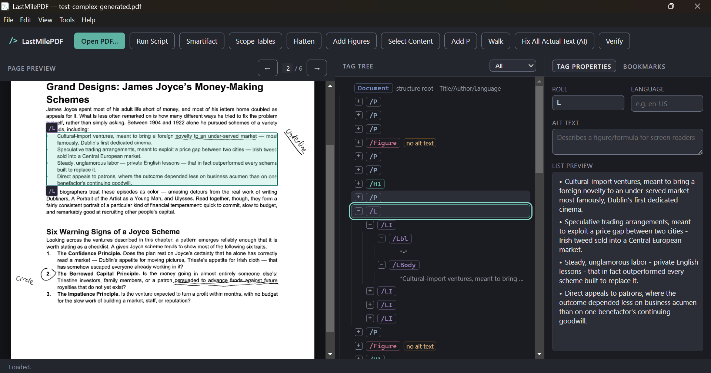

# LastMilePDF

<!-- GitHub honours prefers-color-scheme inside <picture>, so this follows the
     reader's own GitHub theme. The alt text sits on the  and serves every
     source, which is why it does not name a theme: which of the two is showing
     depends on the reader, not on us. Dark is the  fallback for anything
     that doesn't support <picture>, matching the app's own default. -->
<picture>
  <source media="(prefers-color-scheme: light)" srcset="docs/assets/lastmilepdf-light.png">
  <source media="(prefers-color-scheme: dark)" srcset="docs/assets/lastmilepdf-dark.png">
  
</picture>

LastMilePDF is for cleaning up auto-tagged PDFs, especially those made from scanned images. Its purpose is to have the best possible user-interface for manual tag changes, with optional built-in AI assistance for proofreading OCR errors.

For small organizations that can only afford Adobe Acrobat for tagging PDFs, this tool is a companion, since its strengths are in Acrobat's weakness (their terrible UI with no keyboard shortcuts, etc.).

Features:
- Quick, easy tag editing, reordering, conversion, etc. with convenient shortcuts
- Table editor with auto-scope options
- Find/Replace for tag types
- Visual script builder for sequencing/automating repeated actions
- Flatten button for removing extraneous span/div tags
- Use AI to clean up OCR errors in Actual Text fields, highlighting changes for approval (configurable to use any AI provider)
- Tag figures on scanned pages that were missed by auto-tagger
- Select Content: drag a rectangle over the page preview to select the text under it and tag it with a single keystroke - the rectangle cuts leaves at its own edges, so you can tag half a paragraph as a heading, or a set of bullets as a real list with a Lbl/LBody per item, without touching the tag tree. Ctrl+L does the same for a reference list, whose entries are marked out by a hanging indent rather than by any character in the text
- Two color themes (File > Settings > Preferences > Appearance): the original dark workbench, and a light theme. "Auto", the default, follows the OS light/dark setting. Both meet WCAG 2.1 AA for contrast and the light one goes further, to 7:1 for text; switching the app's own UI is instant - no restart. The menu bar and title bar are drawn by Electron/Windows rather than by our CSS, so they follow `nativeTheme.themeSource` instead, and on Windows the title bar may not repaint until the next launch
- Easily filter to just figures for quick alt-text adding, tables for reviewing, etc.
- Walk feature walks the tree automatically at the pace you set so you don't have to keep pressing the down key to walk the whole tree
- Proofread mode allows quick comparison between OCR text and original image with AI fixes highlighted in yellow
- Show AT Changes lets you highlight any differences between Actual Text and the OCR text so review your own edits
- Smartifact automatically artifacts full-page figures at a click (for when auto-taggers generate figures for every page of a scanned document, a common nuisance)
- Repair Orphaned Content finds marked content that's neither tagged nor a real PDF artifact - leftover from a deleted tag, or inserted by other software (e.g. hyphenation/kerning glue around wrapped URLs) - and converts it to a real artifact, so Acrobat's accessibility checker stops flagging it as untagged content

What it is not for and currently can't do:
- It can't run OCR
- It can't auto-tag
- It does not do full manual tagging from scratch. Select Content tags
  content that is already on the page (aimed at scans that have had OCR
  applied), but there is no way to author structure for a page that has no
  text under it at all

These are all things we may add for the future, but as said above the idea for now is to compliment the technologies people are most likely to already have: Adobe Acrobat, etc.

## Info For Developers

This is pretty much entirely vibe-coded using Claude. The rest of the readme is info written by Claude.

A standalone Electron app for viewing a PDF and editing its accessibility
structure tree (the tag tree behind PDF/UA compliance). 

Vanilla JavaScript, no framework, no bundler, no TypeScript.

## Architecture

```
renderer/ (Chromium, no Node access)
  index.html    - layout: toolbar, PDF canvas pane, tag tree pane, details form
  renderer.js   - entry point: event wiring, menu handlers
  styles.css

  state.js dom.js util.js pdfjs.js        - leaves: shared state, elements, helpers
  shell.js tree-index.js page-content.js  - title/status, tree lookups, page reads
  viewer.js       - PDF.js page rendering + the tag highlight overlay
  tree-view.js    - the tag tree: rows, filtering, drag/drop, selection
  details.js      - the tag properties pane
  editing.js      - structural edits: move, delete, role changes, grouping, undo
  doc-io.js       - open / save / close
  rect-select.js  - Select Content: the rubber-band rectangle, the glyph
                    boxes it is measured against, and the cut offsets it
                    hands the worker
  bookmarks.js verify.js table-preview.js table-editor.js list-preview.js
  actual-text.js find-replace.js walk.js figure-draw.js ai-batch.js
  split-content.js proofread.js actions.js scripts.js
                  - one feature each; see "Renderer module layout" below

preload.js      - contextBridge: exposes window.api.{openPdf,updateNode,updateNodes,
                  shiftHeadingLevels,reorderNode,reorderMany,flattenTags,undo,redo,
                  savePdf,saveToPath,getPageCodeBoxes,tagRectContent,wrapLeaves,
                  onMenu*}
main.js         - BrowserWindow, native dialogs, owns the Python sidecar process

python/
  tag_worker.py - long-running pikepdf sidecar, speaks JSON-lines over stdio
  glyph_metrics.py       - places every character a page paints, in PDF page
                           space, by replaying the content stream's text state
  standard_fonts.py      - encoding + AFM width lookup for the standard 14
  standard_fonts_data.py - generated tables behind it (see scripts/)
  requirements.txt

scripts/         - typecheck, smoke test, and the generators for the
                   standard-14 tables and the standard-14 fixture
build/           - installer icon (icon.ico/icon.png)
python-dist/      - PyInstaller output (tag_worker.exe), gitignored
dist/             - electron-builder output (installer/portable exe), gitignored
```

`main.js` spawns `python/tag_worker.py` once at startup and keeps it alive
for the life of the app, rather than shelling out per edit - that avoids
re-parsing the PDF on every tag change. Communication is newline-delimited
JSON on stdin/stdout:

```
-> {"id": 1, "cmd": "open", "path": "/path/to/file.pdf"}
<- {"id": 1, "result": {"docId": "...", "hasStructTree": true, "tree": {...}}}
```

Every mutating command (`update_node`, `reorder`) returns the **entire**
rebuilt tree rather than a patch. Node ids are just a depth-first counter
reassigned on every rebuild, so the renderer always throws away its old
tree and re-renders from the fresh one - there's no way for the UI to hold
a stale id that silently points at the wrong node after an edit.

PDF.js renders the page preview and is linked to the tag tree in both
directions: selecting a tag highlights its marked content on the page,
and clicking marked content on the page selects its owning tag.

## Setup

**1. Install Node dependencies**

```
npm install
```

**2. Install the Python sidecar's dependency**

The worker needs `pikepdf` on whatever Python interpreter `main.js` will
spawn (`python3` on macOS/Linux, `python` on Windows, or override with the
`PYTHON_BIN` environment variable - see below). A virtual environment is
recommended:

```
python3 -m venv .venv
source .venv/bin/activate        # .venv\Scripts\activate on Windows
pip install -r python/requirements.txt
```

If you use a venv, run the app with `PYTHON_BIN` pointing at its
interpreter, e.g. `PYTHON_BIN=$(pwd)/.venv/bin/python npm start`.

**3. Run it**

```
npm start
```

## Renderer module layout

The renderer is split into small ES modules, loaded natively by the browser -
still no bundler and no build step. `renderer.js` is the entry point: it holds
the event wiring (which button does what, which menu message goes where) and
imports everything else.

Modules are layered, and the layering is what keeps the graph from tangling:

| Layer | Modules | Depends on |
| --- | --- | --- |
| Leaves | `state`, `dom`, `util`, `pdfjs` | nothing |
| Low-level | `shell`, `tree-index`, `page-content` | leaves |
| Features | `viewer`, `tree-view`, `details`, `bookmarks`, `table-preview`, `table-editor`, `list-preview`, `actual-text`, `editing`, `doc-io`, `verify`, `find-replace`, `walk`, `figure-draw`, `rect-select`, `split-content`, `proofread`, `ai-batch`, `actions`, `scripts` | the above |
| Entry | `renderer.js` | everything |

One file sits outside this graph on purpose: **`theme-boot.js`** is a classic
script (no `type="module"`, no `defer`) loaded from `<head>`, so it runs while
the parser is still above `<body>`. That is the only moment early enough to
put the saved theme on `<html>` before the first paint; a deferred module
would paint dark first and then switch, on every launch. It imports nothing
and is the one place in the renderer that reads a preference synchronously -
see `getResolvedThemeSync()` in `preload.js`. The app's CSP forbids inline
scripts, which is why it is a file rather than a `<script>` block.

Two things are worth knowing before moving code between them:

- **`state.js` and `dom.js` must stay leaves.** Everything imports them, so
  the moment one of them imports a feature module, most of the renderer
  becomes one cycle. `npm run typecheck` fails if that happens.
- **There is exactly one deliberate import cycle**, `tree-view` <->
  `details`: selecting a row refreshes the properties pane, and editing in
  that pane rewrites the tree. It is safe only because every function
  crossing it is a hoisted `function` declaration. The reasoning is written
  out at the top of `renderer/tree-view.js`, and `npm run typecheck` reports
  any *other* cycle that appears.
- **`actions.js` holds the one copy of each action a script can run**
  (Smartifact, Repair Orphaned Content, Scope Tables, Flatten All,
  Find/Replace, Fix All Actual Text (AI)). Every other trigger for the same
  action - a toolbar button, a Tools menu item, the Verify panel's inline
  "Repair" button, or `scripts.js`'s Tools > Scripts… runner - calls the
  same function, so it behaves identically no matter which one fired it.

## Measuring glyphs (Select Content)

Select Content asks a question the rest of the app never had to: *which
characters does this rectangle cover?* Nothing in the struct tree answers
that, so `python/glyph_metrics.py` works it out from the page itself -
replaying enough of the content stream to track the text state, and placing
every glyph the page paints in PDF page space.

Two different jobs, with two different requirements, and separating them is
what makes near-total coverage possible:

| Job | Needs | Fallback when the font refuses |
| --- | --- | --- |
| Select a leaf | glyph *widths* (a box is enough) | pdf.js text-run geometry - still selectable, just indivisible |
| Cut a leaf at an offset | `/ToUnicode` (naming a character boundary) | the leaf is taken whole, and its overhang is drawn dashed |

Widths come from three places, in order: an embedded `Identity-H`
CIDFont's `/W`, a simple font's `/Widths`, and - for a standard-14 face
that legally carries no metrics at all - Adobe's AFM tables via
`standard_fonts.py`, which needs two lookups (code -> glyph name via the
font's encoding, glyph name -> width via the AFM table) and refuses rather
than guessing at either. Those tables are *generated*, not transcribed:
`scripts/generate-standard-fonts.mjs` lifts them out of `pdfjs-dist`, which
is already a dependency, and checks the result against known AFM values
before writing `standard_fonts_data.py`.

Three behaviours worth knowing before touching this code:

- **A refusal poisons its whole span.** A span can switch fonts partway
  through; if the first font measures and the second doesn't, the glyphs
  already emitted would come back looking like a complete span, and offsets
  counted off them would index a string that stops short of the real text.
- **`/Ascent 0 /Descent 0` counts as undeclared**, and falls back to nominal
  values. Some subsetted faces declare exactly that, which otherwise
  collapses every glyph box to zero height - zero area, so zero coverage, so
  a leaf no rectangle could ever select.
- **Never use pdf.js geometry to pick a split index**, only to select. It
  agrees closely enough to draw a box and nowhere near well enough to name a
  character boundary.

Verified against pdf.js at 0.000pt agreement on every font path it
exercises. Across a 22-file corpus of real course readings (645 pages,
15,540 marked-content spans, 1.34M glyphs), every refusal names a reason,
and after the standard-14 work the only reason left is a font with no
`/ToUnicode` - which `split_leaf()` already declines too, so Select Content
and Split Content now agree exactly on which leaves can be divided.

Having the geometry pays off beyond cutting: `hangingIndentItems()` in
`rect-select.js` finds the entries of a reference list purely from where
each line begins, which is the only place that structure exists. It looks
across the whole selection rather than within each run, because how a list
is carved into leaves varies completely in the direction that matters - a
born-digital page paints a whole reference list as one run, while an OCR'd
scan gives every line its own, and working per run would find nothing at all
on the scans this is mostly aimed at.

## Type checking

The code is plain JavaScript with no build step - `npm start` runs the
source directly. Types are supplied by JSDoc comments and the declarations
in `types/`, and checked without compiling anything:

```
npm run typecheck
```

It covers `main.js`, `preload.js`, `scripts/` and every module in
`renderer/`, and reports mistakes TypeScript can see statically: a misspelled
`window.api` method or `state` field, a call with the wrong number of
arguments, a string where a number belongs, a property that doesn't exist on
an element, a name used in a module that doesn't import it. It also reports
unexpected import cycles (see above). It emits nothing and changes nothing.

Two projects are checked, because the two halves of the app run in different
places and need opposite settings:

| Config | Covers | Environment |
| --- | --- | --- |
| `jsconfig.json` | `main.js`, `preload.js`, `scripts/` | CommonJS, Node globals |
| `renderer/jsconfig.json` | every module in `renderer/` | ES modules, DOM globals |

Shared shapes live in `types/domain.d.ts` (what crosses the JS/Python
boundary) and `types/app-state.d.ts` (the renderer's `state` object). The
type of `window.api` isn't written out by hand - it's derived from the
object `preload.js` exposes, so the bridge and the renderer can't drift
apart.

Two caveats worth knowing:

- The Python worker is a separate process handing over JSON. TypeScript
  can't check it, so `types/domain.d.ts` is a written-down contract, not a
  proof - **if you change a dict key in `tag_worker.py`, change it there
  too.**
- Settings are deliberately loose (`strict` and `noImplicitAny` off), so an
  unannotated parameter is simply untyped rather than an error. Tighten them
  as more of the code gains annotations.

## Tests

```
npm test
```

Runs two things: `scripts/contrast-check.js` first (instant, no Python
needed), then `scripts/smoke-test.js`, which drives `python/tag_worker.py`
directly over the same JSON-lines protocol `main.js` uses - no Electron and no
UI involved. It takes about 8 seconds.

### `scripts/contrast-check.js`

```
npm run test:contrast
```

Asserts that `renderer/styles.css` actually meets the contrast targets its two
themes claim: 4.5:1 text for dark (WCAG 2.1 AA) and 7:1 for light (AAA), plus
3:1 for control boundaries and for the outlines drawn on the PDF page. It also
checks that both theme blocks declare the same palette, and that every
`var(--x)` in the file resolves.

Light aiming at 7:1 rather than 4.5:1 is deliberate. There were briefly two
light themes - a 4.5:1 one and a 7:1 high-contrast one - but they landed close
enough that keeping both was not worth the second palette to maintain, so the
stronger one became the light theme outright. `main.js` maps a saved
`"accessible"` preference onto `"light"` for anyone who had picked it.

Both of those are things a person cannot eyeball. A later "make this a bit
dimmer" gets no pushback from the type checker, and a token missing from one
theme block is invisible until someone switches to that theme and finds one
theme's text on another theme's ground. The check exists so the claim in the
header comment of `styles.css` stays true rather than becoming folklore.

It also covers the marketing site in `docs/`, which uses the same two
palettes and the same token names but picks between them with
`prefers-color-scheme` rather than a stored preference. The site gets its own
section because its surfaces are not the app's - cards stack differently, and
its tinted pills and columns are pairs the app never makes. One of those
caught a real problem: the role pill put `--accent` as text on an 18% tint of
itself, which pulls the ground toward the text and measured 3.99:1 in dark.

Three details worth knowing if you edit it. Every colour token has to be a hex
literal, because a named colour would come through as `NaN` and compare false
against every threshold - failing for the wrong reason. Each foreground is
measured against *every* background surface rather than its intended one; both
defects found while the themes were being built were a token landing on a
surface nobody had thought about. And the pairs themselves are listed by hand
rather than derived from the CSS rules, so the check notices a *value* drifting
out of range but cannot notice a rule that starts reaching for a different
token - swapping that role pill back to `--accent` passes, because the check
still measures the pairing it was told about.

This covers the layer where the bugs actually happen. The worker is where PDF
semantics live, and a wrong edit there produces a file that looks correct in
this app but is broken in Acrobat; neither the type checker nor the renderer
can see that. Nearly every test therefore has the same shape:

> make an edit -> save -> reopen the saved file -> check the edit is really
> there and the document still parses

An edit that only holds until you close the file is exactly the failure mode
worth catching, and it is invisible from inside the running app.

The suite runs against three checked-in fixture PDFs. `test-complex-generated.pdf`
carries the bulk of it: alt text and Actual Text, document title/author/language,
role changes, delete, insert, reorder, undo/redo, flatten,
figure-from-rectangle, list grouping, table scoping and structure, bookmarks,
rejection of bad input, glyph placement, leaf splitting, and the whole
Select Content path (tagging a whole tag's content, part of one,
a run across several, list items and their labels, and the cut ordering that
keeps offsets valid). The other two exist because that one cannot reach the
path in question, and each is regenerated by a script beside it:
`test-standard14.pdf` for the standard-14 AFM metrics path, since every font
in the complex fixture embeds its own metrics
(`scripts/make-standard14-fixture.py`), and `test-crosspage-spans.pdf` for
organizational tags that carry a page their parent doesn't share, since every
wrapper in the complex fixture sits on the same page as its parent
(`scripts/make-crosspage-fixture.py`). All three are opened read-only; every
save goes to a temp directory that is removed afterwards.

Two checks are worth singling out, because they guard the property that
matters most for a tool that rewrites content streams: the engine's glyph
positions are asserted to match what `split_leaf()` independently decodes,
and a rectangle's cuts are asserted to leave every glyph on the page exactly
where it was.

Tests **skip** rather than fail when the fixture lacks suitable input for a
given check. Skips are reported so a fixture change that silently stops
exercising something is visible.

Adding a check is worthwhile whenever a bug turns out to have been in
`tag_worker.py`: reproduce it as an edit/save/reopen assertion, and it can't
come back quietly.

## Packaging

For distribution to users who don't have Node or Python installed, the app
ships with the tag worker compiled into a standalone executable (via
PyInstaller) rather than spawning a system Python. Windows and Linux are
both built and CI-tested (`.github/workflows/release.yml` builds both on
every version tag); see "Platform support" below for macOS.

**Windows:**

```
pip install pyinstaller   # into .venv, alongside pikepdf
npm run dist:win
```

This runs two steps:

1. `build:worker` - compiles `python/tag_worker.py` (with `pikepdf` and its
   bundled `qpdf`/`msvc` DLLs) into `python-dist/tag_worker.exe`.
2. `electron-builder --win` - bundles the app plus that exe (as
   `resources/python/tag_worker.exe`) into `dist/`, producing:
   - `LastMilePDF Setup <version>.exe` - a per-user NSIS installer
     (`perMachine: false`, so it installs to the user's own AppData and
     never triggers a UAC/admin prompt).
   - `LastMilePDF-<version>-portable.exe` - a single portable exe, no
     install step at all.

Neither build is code-signed, so first launch on another machine will show
a SmartScreen "Windows protected your PC" warning (unrelated to admin
rights - dismiss via "More info" -> "Run anyway"). Getting rid of that
warning requires a paid code-signing certificate.

**Linux:**

```
pip install pyinstaller   # into .venv, alongside pikepdf
npm run dist:linux
```

Same two steps as Windows, using the venv's own `bin/python` instead of
`Scripts\python.exe`, producing a single `LastMilePDF-<version>.AppImage` -
no install step, just `chmod +x` and run. Running it needs `libfuse2` on
distros that dropped it by default (Ubuntu 22.04+, for one) - see
[AppImage's FUSE requirement](https://docs.appimage.org/user-guide/troubleshooting/fuse.html)
if it won't launch.

`main.js` picks between the dev path (`.venv` + `tag_worker.py`) and the
packaged executable automatically via `app.isPackaged`, and between the
`.exe`/no-extension executable name via `process.platform` - see
`packagedWorkerPath()`.

### Platform support

Windows and Linux are both packaged, CI-built on every release tag, and
covered by `npm test`/`npm run typecheck` in CI (see
`.github/workflows/ci.yml`, which runs on `windows-latest` and
`ubuntu-latest`). **macOS is not currently packaged.** `main.js` already
resolves a `.venv`/Python path for `darwin` the same way it does for
Windows and Linux, so running from source (`npm start`) should work, but
nobody builds, signs, or tests an actual `.app`/`.dmg` - treat that path as
unverified. Unsigned macOS builds are also blocked hard by Gatekeeper
(worse than Windows SmartScreen) without a paid Apple Developer account to
sign and notarize, which is the main reason this isn't done yet. A
`mac` block in package.json's `build` config plus a
`build-macos`/`macos-latest` job in the release workflow (mirroring the
Linux one added here) is what adding it would take, PRs welcome.

### Auto-update

The installed Windows build (NSIS) and the Linux AppImage both check
GitHub Releases for a newer version on launch via
[electron-updater](https://www.electron.build/auto-update), unless turned
off in Preferences - electron-updater supports both formats' self-replace
natively. Finding one only ever shows a native alert - actually
downloading and installing always needs an explicit click, from Help >
About. The Windows *portable* exe can't replace its own running file in
place, so it skips downloading/installing and just opens the release page
instead (see `isPortableBuild` in main.js).

This relies on `.github/workflows/release.yml` uploading each platform's
`latest.yml`/`latest-linux.yml` and `.blockmap` files alongside the
installers - `dist:win`/`dist:linux` build with `--publish never` (see
`build.publish` in package.json), so electron-builder writes those locally
without trying to upload anywhere itself; the workflow's own GitHub
Release step does the actual upload.

## Known limitations

Things this scaffold deliberately does not solve yet:

- **Content leaves can't move across pages.** A bare MCID leaf (unlike an
  `/MCR` or `/OBJR` dict) has no `/Pg` of its own - it inherits whatever
  page its containing StructElem resolves to - so reparenting one onto a
  tag on a different page is refused rather than silently mislabeling
  which page it points at. Same-page reordering/reparenting is supported.
- **`RoleMap` / `ClassMap` are ignored.** Custom (non-standard) role names
  round-trip as opaque strings; nothing here resolves them against a
  document's `RoleMap`.
- **Whole-file IPC transfer.** The opened PDF is read into memory and
  passed to the renderer as base64 in one shot. Fine for typical
  documents; a very large PDF would benefit from streaming instead.
- **A leaf can only be cut where the font can be read.** Selecting content
  needs glyph widths, but *dividing* a leaf needs its `/ToUnicode` to name a
  character boundary. A font without one (some OCR output, notably) leaves
  its text selectable but indivisible: the rectangle takes the whole leaf and
  draws the overhang dashed rather than guessing where to cut. Same for a
  rectangle down a vertical slice of a wrapped paragraph, where the covered
  characters aren't one unbroken run - no single pair of cuts keeps those and
  only those.
- **Single document at a time.** No tabs/multi-document support.

## Contributing

Bug reports and PRs are welcome - see [CONTRIBUTING.md](CONTRIBUTING.md)
for how to get set up and what to check before opening a PR. This project
follows a [Code of Conduct](CODE_OF_CONDUCT.md). Found a security issue?
See [SECURITY.md](SECURITY.md) rather than opening a public issue.

## Troubleshooting

- **"pikepdf is not installed"** - the interpreter `main.js` spawned
  doesn't have pikepdf. Confirm which interpreter that is (see
  `PYTHON_BIN` above) and `pip install -r python/requirements.txt` into it.
- **Worker seems to hang, or something else goes wrong** - check the log
  file (Help > Open Log Folder), which mirrors every diagnostic message
  main.js logs for the current session, including the Python worker's
  stderr/tracebacks. Running from source, the same output also goes to the
  terminal running `npm start`. The log is truncated fresh on every
  launch, so reproduce the problem before checking it.

## License

MIT - see [LICENSE](LICENSE).

This app bundles two open-source dependencies with their own licenses:
[pikepdf](https://github.com/pikepdf/pikepdf) (MPL-2.0), compiled into the
packaged `tag_worker.exe`, and [pdf.js](https://github.com/mozilla/pdf.js)
(Apache-2.0), which renders the page preview.
